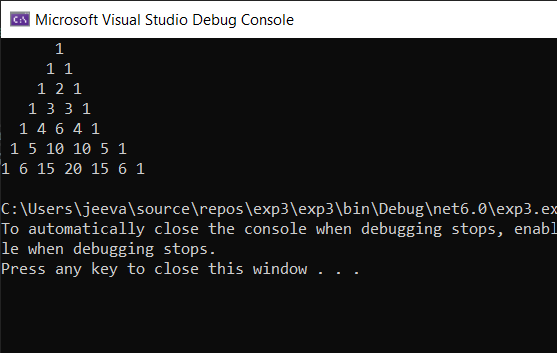

# Pattern

## Aim:

## Equipment Required:

## Algorithm:
### Step 1:
Initialize the necessary attributes.

### Step 2:
Get the limit from the user.

### Step 3:
using for loop print the rows and columns and space.

Step 4:
Check the first and last rows of the triange is 1 using if condition.

Step 5:
Otherwise use else to print the inner value

val = val * (i - j + 1) / j;

Step 6:
Check the program for any error.

if not.

Step 7:
print the program.

## Program:
~~~
// See https://aka.ms/new-console-template for more information
using System;
namespace pattern
{
    public class pascal
    {
        static void Main(string[] args)
        {
            int i, rows = 7,val=1 ;
            for(i=0; i < rows; i++)
            {
                for (int space = 1; space < rows - i; space++)
                {
                    Console.Write(" ");
                }
                    for(int j=0;j<=i;j++)
                    {
     
                        if (i==0||j==0)
                        {
                             val = 1;
                        }
                        else
                        {
                            val = val * (i - j + 1)/j;
                           
                        }
                    Console.Write(val + " ");
                    

                    }
                Console.WriteLine();

            }
            

        }
        
    }
    
}

~~~

## Output:

## Result:
Thus,To write a C# program for a pascal's triangle is written and executed.
